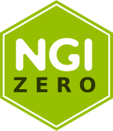

  <h1>mCaptcha Browser Benchmark</h1>

<strong>Benchmark mCaptcha on your browser</strong>

Visit https://mcaptcha.github.io/benches/ to run the benchmark

## Funding

### NLnet

	

 

2023 development is funded through the [NGI0 Entrust
Fund](https://nlnet.nl/entrust), via [NLnet](https://nlnet.nl/). Please
see [here](https://nlnet.nl/project/mCaptcha/) for more details.
